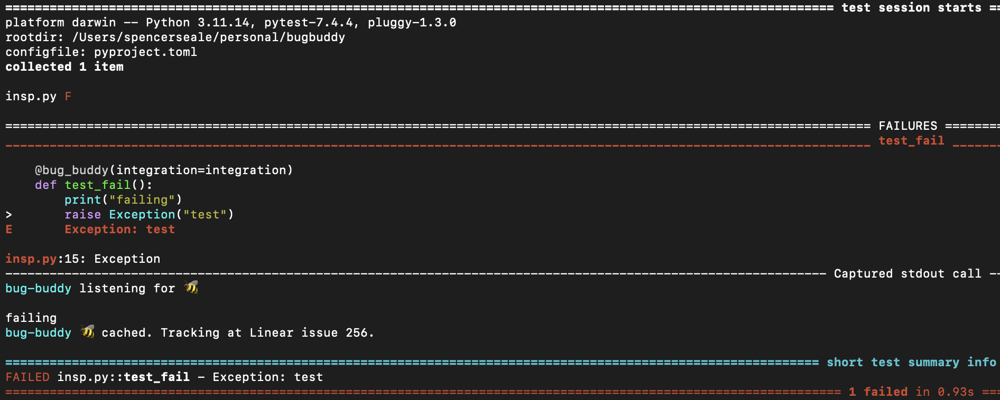
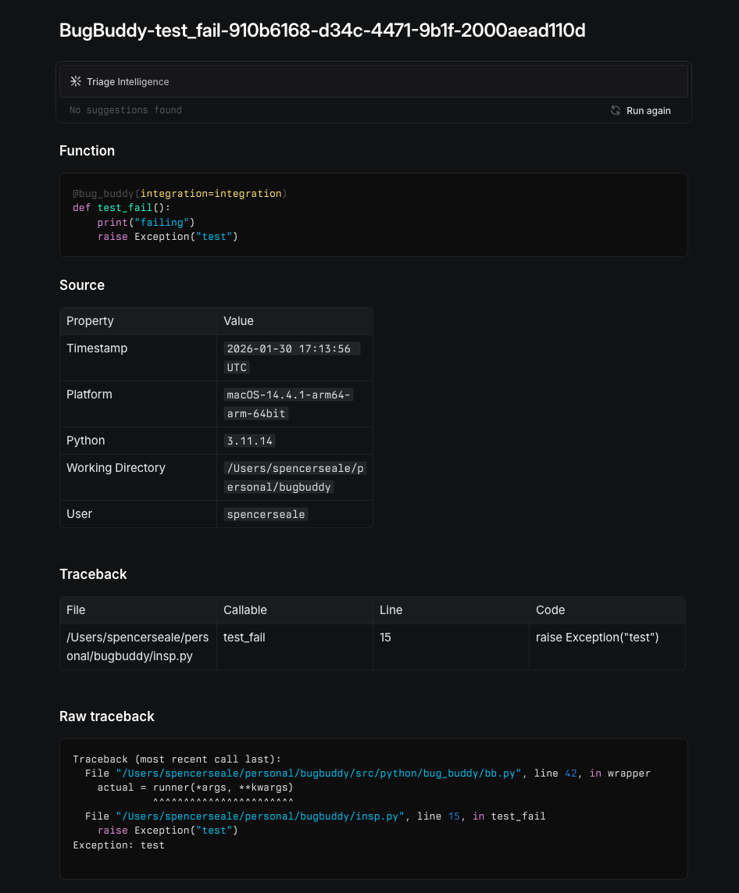

# Bug Buddy

Bug Buddy helps you take action on exceptions in your code.

Too often do we encounter bugs in our code that are not properly managed and fixed. Prescribing to the notion that code is in an ever-improving state, Bug Buddy helps developers track both high-frequency and one-off bugs by autocaching locally and uploading to an issue tracker so they may be linked to appropriate update branches.

Bug Buddy works best when paired with `pytest` or `unittest` to automatically create issues for each test failure encountered during CI/CD.

Bug Buddy works with the following issue trackers:

* Gitlab
* Github
* Linear

## Installation


[](https://python-poetry.org/)
[](https://github.com/pre-commit/pre-commit)
[](https://github.com/psf/black)
[](https://github.com/astral-sh/ruff)

You can install Bug Buddy using pip:

```bash
pip install bug-buddy
```

## Usage

Set the API token for where you'd like to track issues.

| Remote | Env Variable |
| --- | --- |
| Linear | $LINEAR_API_KEY |
| Gitlab | $GITLAB_TOKEN |
| Github | $GITHUB_TOKEN |

To use Bug Buddy, you need only to import it and decorate the top-level callable of your code with `@bug_buddy`:

```python
import pandas as pd
from bug_buddy import bug_buddy, LinearIntegration

integration = LinearIntegration(
    team_id=<linear_team_id>,
    project_id=<linear_project_id>,
)

@bug_buddy(integration=integration)
def test_fail() -> None:

    raise Exception("test")
```

* Running this code, Bug Buddy returns the exception traceback just as you'd normally expect.

```bash
pytest
```

* stdout will show the pytest output just as you'd normally expect.



* As requested in `@bug_buddy`, the issue is logged to Linear
* If run in Github Actions or Gitlab CI, it will also log CI environment variables to the issue report.



In addition to the remote, the issue is cached to `$HOME/.bug_buddy.cache`, to enable offline bug tracking.

```json
{
    "id": "<issue_id>",
    "title": "BugBuddy-test_fail-910b6168-d34c-4471-9b1f-2000aead110d",
    "state": "Triage",
    "project_id": "<project_id>",
    "author": "Spencer Seale",
    "created_at": "2026-01-30T17:13:57.022Z",
    "updated_at": "2026-01-30T17:13:57.022Z",
    "description": "### Function\n\n```python\n@bug_buddy(integration=integration)\ndef test_fail():\n    print(\"failing\")\n    raise Exception(\"test\")\n```\n\n### Source\n\n| Property | Value |\n| -- | -- |\n| Timestamp | `2026-01-30 17:13:56 UTC` |\n| Platform | `macOS-14.4.1-arm64-arm-64bit` |\n| Python | `3.11.14` |\n| Working Directory | `/Users/spencerseale/personal/bugbuddy` |\n| User | `spencerseale` |\n\n### Traceback\n\n| File | Callable | Line | Code |\n| -- | -- | -- | -- |\n| /Users/spencerseale/personal/bugbuddy/insp.py | test_fail | 15 | raise Exception(\"test\") |\n\n### Raw traceback\n\n```\nTraceback (most recent call last):\n  File \"/Users/spencerseale/personal/bugbuddy/src/python/bug_buddy/bb.py\", line 42, in wrapper\n    actual = runner(*args, **kwargs)\n             ^^^^^^^^^^^^^^^^^^^^^^^\n  File \"/Users/spencerseale/personal/bugbuddy/insp.py\", line 15, in test_fail\n    raise Exception(\"test\")\nException: test\n```",
    "labels": "Bug"
}
```

## Parameters

The `@bug_buddy` decorator connects to the issue tracker of your choice by passing the appropriate integration:

* `GitlabIntegration`
* `GithubIntegration`
* `LinearIntegration`

## Contribute

Contributions are welcome! Please feel free to contribute at https://github.com/spencerseale/bugbuddy
