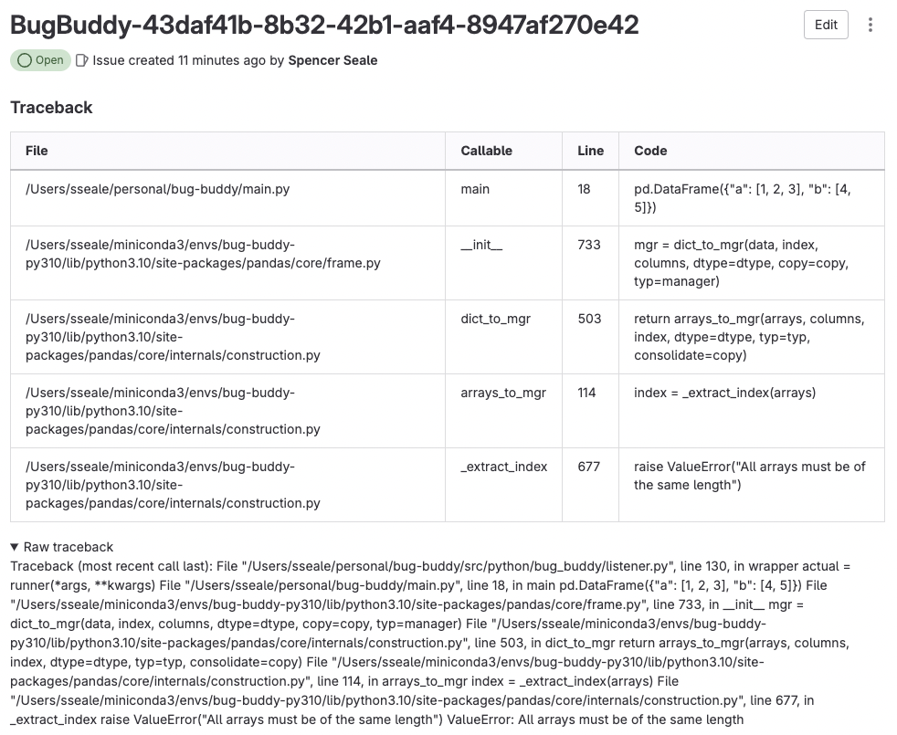

# Bug Buddy

Bug Buddy is a python library that helps you take action on exceptions in your code.

It is primarily a decorator that will locally cache exceptions and, if specified, upload the exception as a gitlab or github issue. Too often do we encounter bugs in our code that are not properly managed and fixed. Prescribing to the notion that code is in an ever-improving state, Bug Buddy helps devlopers track both high-frequency and one-off bugs by autocaching locally and uploading to a remote so they may be linked to appropriate update branches.

## Installation


[](https://www.python.org)
[](https://python-poetry.org/)
[](https://github.com/pre-commit/pre-commit)
[](https://github.com/psf/black)
[](https://github.com/astral-sh/ruff)

You can install Bug Buddy using pip:

```
pip install bug-buddy
```

## Usage

To use Bug Buddy, you need to import it and decorate the top-level callable of your code with `@bug_buddy`. For example:

```
import pandas as pd
from bug_buddy import bug_buddy

@bug_buddy(project_id=43922234, gitlab=True)
def main() -> None:
    """Runner function.

    Create a dataframe with two columns.

    Expect to throw a ValueError with the exception logged
    to Gitlab by bug_buddy.
    """

    pd.DataFrame({"a": [1, 2, 3], "b": [4, 5]})
```

Running this code, Bug Buddy returns the exception traceback just as you'd normally expect, but an issue is logged to Gitlab



In addition to the remote, the issue is cached to `$HOME/.bug_buddy.cache`, to enable offline bug tracking.
```
[
    {
        "id": 140872896,
        "title": "BugBuddy-4a8dd26c-2faa-4780-b01d-75965cf4896a",
        "state": "opened",
        "project_id": 43922234,
        "author": "Spencer Seale_spencerseale_active",
        "created_at": "2024-01-16T00:14:22.388Z",
        "updated_at": "2024-01-16T00:14:22.388Z",
        "description": "### Traceback\n| File | Callable | Line | Code |\n| --- | --- | --- | --- |\n| /Users/sseale/personal/bug-buddy/main.py | main | 18 | pd.DataFrame({\"a\": [1, 2, 3], \"b\": [4, 5]}) |\n| /Users/sseale/miniconda3/envs/bug-buddy-py310/lib/python3.10/site-packages/pandas/core/frame.py | \\_\\_init\\_\\_ | 733 | mgr = dict_to_mgr(data, index, columns, dtype=dtype, copy=copy, typ=manager) |\n| /Users/sseale/miniconda3/envs/bug-buddy-py310/lib/python3.10/site-packages/pandas/core/internals/construction.py | dict\\_to\\_mgr | 503 | return arrays_to_mgr(arrays, columns, index, dtype=dtype, typ=typ, consolidate=copy) |\n| /Users/sseale/miniconda3/envs/bug-buddy-py310/lib/python3.10/site-packages/pandas/core/internals/construction.py | arrays\\_to\\_mgr | 114 | index = _extract_index(arrays) |\n| /Users/sseale/miniconda3/envs/bug-buddy-py310/lib/python3.10/site-packages/pandas/core/internals/construction.py | \\_extract\\_index | 677 | raise ValueError(\"All arrays must be of the same length\") |\n\n<details><summary>Raw traceback</summary>\nTraceback (most recent call last):\n  File \"/Users/sseale/personal/bug-buddy/src/python/bug_buddy/listener.py\", line 149, in wrapper\n    actual = runner(*args, **kwargs)\n  File \"/Users/sseale/personal/bug-buddy/main.py\", line 18, in main\n    pd.DataFrame({\"a\": [1, 2, 3], \"b\": [4, 5]})\n  File \"/Users/sseale/miniconda3/envs/bug-buddy-py310/lib/python3.10/site-packages/pandas/core/frame.py\", line 733, in __init__\n    mgr = dict_to_mgr(data, index, columns, dtype=dtype, copy=copy, typ=manager)\n  File \"/Users/sseale/miniconda3/envs/bug-buddy-py310/lib/python3.10/site-packages/pandas/core/internals/construction.py\", line 503, in dict_to_mgr\n    return arrays_to_mgr(arrays, columns, index, dtype=dtype, typ=typ, consolidate=copy)\n  File \"/Users/sseale/miniconda3/envs/bug-buddy-py310/lib/python3.10/site-packages/pandas/core/internals/construction.py\", line 114, in arrays_to_mgr\n    index = _extract_index(arrays)\n  File \"/Users/sseale/miniconda3/envs/bug-buddy-py310/lib/python3.10/site-packages/pandas/core/internals/construction.py\", line 677, in _extract_index\n    raise ValueError(\"All arrays must be of the same length\")\nValueError: All arrays must be of the same length\n\n</details>",
        "labels": "BugBuddy_ValueError"
    }
]
```

## Parameters

The `@bug_buddy` decorator accepts the following parameters:

- `project_id`: The ID of the repository that issues are to be created for. You can find the ID by going to the project's homepage and clicking on the **Project information** button.
- `gitlab`: A boolean value indicating whether to upload the exception to Gitlab or not. Default is `False`.
- `github`: A boolean value indicating whether to upload the exception to Github or not. Default is `False`.

## Features

Bug Buddy has the following features:

- It supports both Gitlab and Github (**IN DEV**), and you can choose which one to use by setting the `gitlab` or `github` parameter to `True`.
- It automatically creates a formatted issue for the exception, including the traceback, the code snippet, and the environment information.
- It tags the issue with exception type encountered.
- It caches the exceptions locally in a JSON file stored in `$HOME`, so you can access them offline or delete them if needed.
